# 🚢 Awesome Ship Management

  

  
  
  
  
  
  

## 🌊 Top Ship Management Ecosystem & Maritime ERP Software

**Curated List of Commercial SaaS Products, Enterprise Maritime ERP Systems & Open-Source GitHub Projects**  
*Focused on Fleet Technical Management, Planned Maintenance Systems (PMS), Vessel Operations, Procurement, Crewing, QHSE, ISM Compliance & Telematics*  
📅 **Last updated: September 2026**

---

## 📌 Executive Summary & Industry Overview

This repository maintains an authoritative guide to commercial **SaaS fleet management suites**, **maritime ERP systems**, and **open-source vessel tools**. These solutions enable ship owners, technical superintendents, fleet managers, and charterers to optimize vessel operations, streamline spare parts procurement, track ISM/ISO compliance, and connect vessel-to-shore telemetry.

### 🌐 Market Size & Sector Structure
> 📊 **Global Maritime Software Market Size**: The global fleet management and maritime ERP software market is estimated at **$3.5 Billion – $5.2 Billion** (growing at an 8.5% CAGR).  
> 🧩 **Market Fragmentation**: The sector is **moderately to highly fragmented**. Industry leadership is distributed across major classification societies (*DNV, ABS, RINA*), established maritime software ERP providers (*Veson, SpecTec, ShipNet*), and specialized cloud SaaS platforms (*NAVTOR, MariApps, Helm CONNECT*) rather than a single winner-take-all monopoly.

---

## 📑 Table of Contents
- [🏢 SaaS & Hosted Commercial Platforms](#-saas--hosted-commercial-platforms)
- [🌐 Open-Source & Source-Available Projects](#-open-source--source-available-projects)
- [🤝 How to Contribute](#-how-to-contribute)
- [⚠️ Disclaimer & Compliance](#%EF%B8%8F-disclaimer--compliance)
- [📈 Star History](#-star-history)

---

## 🏢 SaaS & Hosted Commercial Platforms

Below is the curated list of leading commercial ship management platforms sorted in **descending order by company size** (Annual Revenue / Valuation).

| Platform | Description | Company Size (Revenue / Valuation) ⬇️ | Starting Price | Free Tier / Trial Limit |
| :--- | :--- | :--- | :--- | :--- |
| **[DNV ShipManager](https://www.dnv.com/)** 🚢 | Enterprise fleet technical management, planned maintenance, procurement, crewing, QHSE, and class compliance. | **~$3.2B Revenue** (DNV Group) | $450 / vessel / month | 14-day free trial (sales-assisted access, max 1 vessel) |
| **[Veson Nautical (IMOS / Q88)](https://veson.com/)** 💼 | Commercial maritime freight, chartering, voyage management, and vessel questionnaire ecosystem. | **~$1.2B Valuation** (~$180M Rev) | $500 / month | 14-day free trial (web sandbox for Q88 & IMOS modules) |
| **[ABS Nautical Systems / NS5](https://ww2.eagle.org/)** ⚓ | Comprehensive enterprise platform for fleet maintenance, drydocking, hull integrity, and compliance. | **~$850M Revenue** (ABS Group) | $500 / vessel / month | 30-day guided demo trial (sandbox environment with sample fleet data) |
| **[SERTICA](https://www.sertica.com/)** 🛠️ | Maintenance, procurement, and safety/QHSE management suite by RINA for technical vessel operations. | **~$800M Revenue** (RINA Group) | $300 / vessel / month | 14-day free trial (access to SERTICA demo instance) |
| **[NAVTOR ShipManager / NavFleet](https://www.navtor.com/)** 🗺️ | Digital navigation ecosystem, voyage optimization, passage planning, and fleet performance oversight. | **~$500M Valuation** (~$75M Rev) | $200 / vessel / month | 14-day free trial (full desktop & web demo access for 1 vessel) |
| **[MariApps smartPAL](https://www.mariapps.com/)** 📱 | Flagship cloud maritime ERP suite covering technical management, crewing, finance, and vessel telemetry. | **~$300M Valuation** (~$50M Rev) | $400 / vessel / month | 30-day trial (demo environment with sample fleet data) |
| **[SpecTec AMOS](https://www.spectec.net/)** ⚙️ | Long-established PMS and asset management platform for purchasing, inventory, and vessel operations with offline replication. | **~$250M Valuation** (~$40M Rev) | $350 / vessel / month | 30-day free trial (sales-assisted demo sandbox, max 1 vessel) |
| **[ShipNet](https://www.shipnet.no/)** 🌐 | Integrated maritime software platform spanning technical, commercial, accounting, and voyage management. | **~$150M Valuation** (~$30M Rev) | $400 / month | 14-day free trial (access to standard demo environment) |
| **[BASSnet](https://www.bassnet.no/)** 📋 | Modular maritime ERP covering fleet technical maintenance, safety (QHSE), procurement, and crew management. | **~$120M Valuation** (~$25M Rev) | $350 / vessel / month | 14-day demo trial (pre-configured sandbox account) |
| **[Helm CONNECT](https://www.helmoperations.com/)** 🚤 | Modern fleet operations, maintenance, and compliance software popular with coastal, harbor, and workboat operators. | **~$100M Valuation** (~$20M Rev) | $99 / vessel / month | 14-day free trial (up to 1 vessel & 3 user accounts upon request) |
| **[MESPAS](https://www.mespas.com/)** ☁️ | Cloud-based maritime technical ship management platform for maintenance, procurement, and supplier ordering. | **~$60M Valuation** (~$12M Rev) | $250 / vessel / month | Free forever tier for procurement module (unlimited RFQ/PO workflows); 14-day trial for TSM suite |
| **[OrbitMI](https://www.orbitmi.com/)** 📡 | Cloud fleet performance and AI operational decision support platform connecting vessel IoT data feeds. | **~$40M Valuation** (~$8M Rev) | $300 / vessel / month | 14-day free trial (guided sandbox with sample fleet dataset) |
| **[MarineManager](https://www.marinemanager.com/)** ⛵ | Modular PMS, crewing, and technical fleet maintenance management system designed for ship managers. | **~$25M Valuation** (~$5M Rev) | $150 / vessel / month | 30-day free trial (full features up to 2 vessels) |

---

## 🌐 Open-Source & Source-Available Projects

Below is the list of top open-source repositories, vessel simulators, GPS/AIS parsers, and maritime data frameworks sorted in **descending order by GitHub star count** ⬇️.

- **[Traccar](https://github.com/traccar/traccar)**   
  Leading open-source GPS tracking and fleet location monitoring platform supporting 200+ device protocols, widely deployed for vessel tracking.

- **[OpenCPN](https://github.com/OpenCPN/OpenCPN)**   
  Concise cross-platform chartplotter and maritime navigation application supporting S57/S63 ENCharts, AIS input decoding, and autopilot waypoint navigation.

- **[TinyGPSPlus](https://github.com/mikalhart/TinyGPSPlus)**   
  Customizable C++ NMEA parsing library for extracting maritime position, speed, and timestamp telemetry from onboard GPS receivers.

- **[GPXSee](https://github.com/tumic0/GPXSee)**   
  Open-source GPS log file viewer and analyzer supporting GPX, KML, FIT, and NMEA vessel track files.

- **[Minmea](https://github.com/kosma/minmea)**   
  Lightweight ISO C NMEA-0183 parser library engineered for embedded shipboard microcontrollers and data loggers.

- **[PyGPSClient](https://github.com/semuconsulting/PyGPSClient)**   
  Python graphical GPS client application supporting NMEA, UBX, RTCM3, and NTRIP protocols for real-time vessel positioning.

- **[AIS-catcher](https://github.com/jvde-github/AIS-catcher)**   
  Dual-channel AIS receiver for RTL-SDR and HackRF dongles, decoding Automatic Identification System vessel broadcasts for real-time maritime traffic monitoring.

- **[PyNMEA2](https://github.com/Knio/pynmea2)**   
  Modular Python library for parsing and generating NMEA 0183 protocol messages in shipboard telemetry streams.

- **[SignalK Server](https://github.com/SignalK/signalk-server)**   
  Next-generation central maritime data server for boats, unifying NMEA 0183, NMEA 2000, and sensor feeds into modern web APIs.

- **[LOTUSim](https://github.com/naval-group/LOTUSim)**   
  Open-source multi-domain maritime simulator (Gazebo/ROS-based) for vessel hydrodynamic testing and autonomous operational scenarios.

- **[Hackerfleet / HFOS](https://github.com/Hackerfleet/hfos)**   
  Modular open-source vessel board computer system providing electronic logbooks, geo-information, and onboard collaborative tools.

- **[SeaVesselManager](https://seavesselmanager.com/)**  
  Dedicated source-available (BSL) Planned Maintenance System (PMS) and ship management platform with fleet overview, work orders, spare parts, and offline synchronization. Includes a Free Community Edition for self-hosting.

---

## 🤝 How to Contribute

1. Fork this repository on GitHub.
2. Add or update entries in `README.md` using the established format.
3. For SaaS platforms, include name, link, description, estimated company size, starting tier price, and free tier/trial limit.
4. For open-source tools, include repo link, description, and star badge linking to `/stargazers`.
5. Check out [Awesome-Awesome-Awesome](https://github.com/ishandutta2007/Awesome-Awesome-Awesome) for more curated lists!
6. Open a Pull Request with a short explanation of your additions.

---

## ⚠️ Disclaimer & Compliance

- This repository is a **community-curated index** for informational purposes.
- Ship management and planned maintenance platforms are mission- and compliance-critical systems supporting the **ISM Code, SOLAS, MARPOL, and Class Society audits**. Commercial vessels must verify that chosen systems meet applicable regulatory requirements.
- Source-available and open-source tools offer lower licensing barriers but require rigorous validation regarding offline data replication, security, and class approvals.

---

## 📈 Star History

---

  <b>Made with ❤️ for Technical Superintendents, Fleet Managers, Ship Owners &amp; Maritime Technologists.</b>

